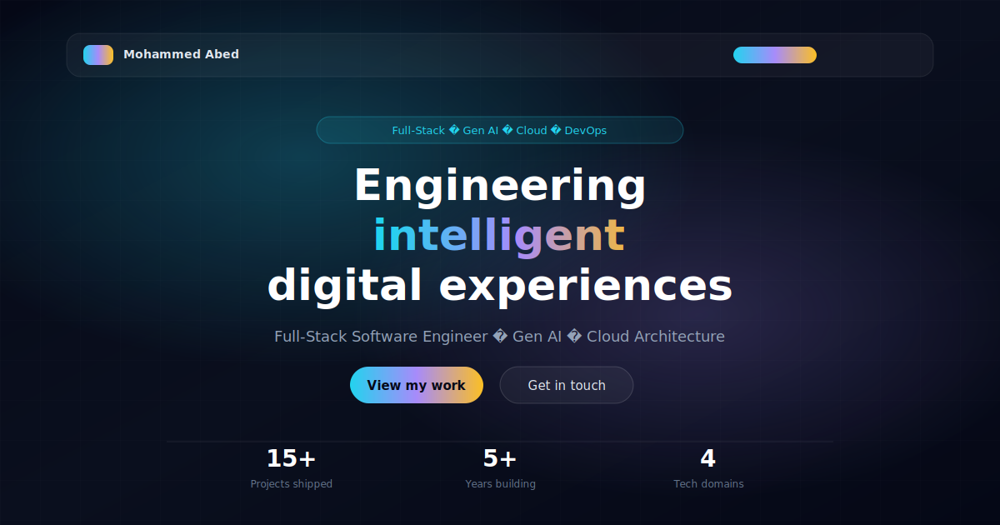

# Mohammed Abed — Portfolio

<div align="center">



**Full-Stack Software Engineer · Generative AI · Cloud · DevOps**

[](https://react.dev/)
[](https://www.typescriptlang.org/)
[](https://vitejs.dev/)
[](https://tailwindcss.com/)
[](https://www.framer.com/motion/)
[](https://www.netlify.com/)

</div>

---

A modern, animation-rich portfolio showcasing full-stack engineering, generative AI expertise, cloud architecture, and DevOps capabilities — built from the ground up with React, Vite, and custom UI components.

## Highlights

- **Generative AI focus** — Dedicated expertise section highlighting LLM integrations, chatbots, RAG, and AI-powered SaaS
- **Full-stack showcase** — React, Next.js, TypeScript, APIs, and production-grade dashboards
- **Cloud & DevOps** — Docker, CI/CD, Netlify/Vercel deployment, and enterprise integration experience
- **Custom animated UI** — Aurora backgrounds, glass morphism cards, marquee tech strip, scroll-triggered reveals, and interactive project filters
- **Project portfolio** — Six live projects including AI Chatbot, Article Summarizer, eCommerce dashboards, and marketing sites

## Tech Stack

| Layer | Technologies |
|-------|-------------|
| **Frontend** | React 18, TypeScript, Tailwind CSS, Framer Motion, Lucide Icons |
| **Build** | Vite 6, ESLint, PostCSS |
| **AI / Gen AI** | OpenAI GPT-4, AI Chatbots, Prompt Engineering, SaaS AI Apps |
| **Cloud / DevOps** | Docker, Netlify, Vercel, Cloudinary, Appwrite, CI/CD |
| **Backend** | Node.js, REST APIs, Appwrite, Syncfusion |

## Project Structure

```bash
Next-Portfolio/
├── public/                  # Static assets (project screenshots, tech icons)
├── src/
│   ├── components/
│   │   ├── layout/          # Navbar, Footer
│   │   ├── sections/        # Hero, About, Expertise, Projects, etc.
│   │   └── ui/              # Reusable animated primitives
│   ├── data/                # Portfolio content (projects, skills, experience)
│   ├── lib/                 # Utilities (cn helper)
│   ├── App.tsx
│   ├── main.tsx
│   └── index.css
├── index.html
├── vite.config.ts
├── tailwind.config.js
└── netlify.toml
```

## Sections

| Section | Description |
|---------|-------------|
| **Hero** | Animated gradient background with rotating specialty tags |
| **About** | Bento-style cards highlighting philosophy and approach |
| **Expertise** | Four pillars — Full-Stack, Gen AI, Cloud, DevOps |
| **Tech Stack** | Categorized skills + infinite marquee of technologies |
| **Projects** | Filterable project grid with live demo links |
| **Experience** | Timeline of professional roles |
| **Process** | Three-phase delivery methodology |
| **Contact** | CTA with email and social links |

## Getting Started

### Prerequisites

- Node.js 18+
- npm or pnpm

### Installation

```bash
# Clone the repository
git clone https://github.com/mabedd/Next-Portfolio.git

# Navigate to the project
cd Next-Portfolio

# Install dependencies
npm install

# Start development server
npm run dev
```

Open [http://localhost:5173](http://localhost:5173) in your browser.

### Build for Production

```bash
npm run build
npm run preview
```

## Deployment

Configured for [Netlify](https://www.netlify.com/) with SPA redirects in `netlify.toml`. Push to your connected branch for automatic deployment.

## Contact

- **Email:** [mohammed.o.abed@outlook.com](mailto:mohammed.o.abed@outlook.com)
- **GitHub:** [@mabedd](https://github.com/mabedd)
- **LinkedIn:** [Mohammed Abed](https://www.linkedin.com/in/mohammed-abed-itil/)

---

<div align="center">
  <p>Built with precision by Mohammed Abed</p>
</div>
